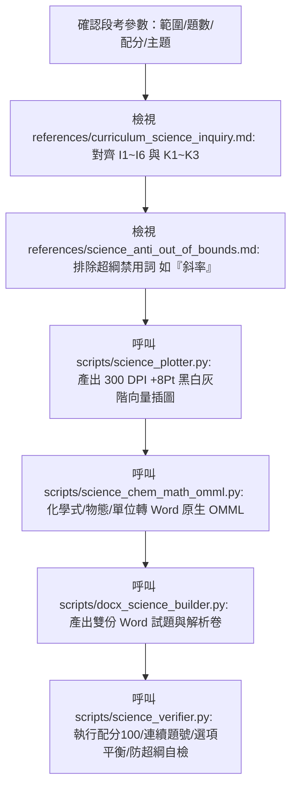

# 國高中自然科命題規範與自動化產卷技能 (jhsh-science-exam-generator)

本 Skill 專門用於指導 Antigravity 代理人自動化命題，生成完全符應「新北市立錦和高級中學」教務處/試務組規範，且深度結合教育部十二年國教自然科學領域核心素養、國教院素養導向評量要素與國際 PISA 2025 科學評量架構之正式試題卷與答案解析卷。

---

## 快速開始：使用者提詞標準模板 (User Prompt Template)

> [!TIP]
> **初次使用或發起新段考任務時，請引導使用者複製以下提詞模板：**

```text
請使用 /jhsh-science-exam-generator 技能為我生成一份國中自然科段考試卷，規格參數如下：
1、範圍：【請填寫範圍，例如：緒論到3-1】。
2、題型：單一選擇題，每題有四個選項。
3、題數：35題。
4、配分：總分100分（第 1～25 題每題 3 分共 75 分；第 26～30 題題組每題 3 分共 15 分；第 31～35 題題組每題 2 分共 10 分）。
5、難易程度：中等偏難。
6、其它：【選填，例如：以皮克敏的故事世界，串連整份試卷題目】。
```

---

## 核心架構與模組設計 (Progressive Disclosure)

本技能採用三層模組化設計（核心引導、執行腳本庫、課綱規範與防超綱參考文獻）：



### 1. 執行輔助腳本庫 (`scripts/`)
- [`docx_science_builder.py`](file:///C:/Users/genie/.gemini/config/skills/jhsh-science-exam-generator/scripts/docx_science_builder.py)：封裝 1cm 頁邊界、全卷 11 點標楷體、粗體底線抬頭、扣 5 分警語、題號凸排、右側浮動矩形文繞圖（`wrapSquare`，節省 40%~50% 版面）與動態頁碼 `〔第 X 頁，共 Y 頁〕`。
- [`science_chem_math_omml.py`](file:///C:/Users/genie/.gemini/config/skills/jhsh-science-exam-generator/scripts/science_chem_math_omml.py)：處理化學式上下標、反應箭頭、物態標記、同位素與科學單位之 Word 原生可編輯 OMML `<m:oMath>`。
- [`science_plotter.py`](file:///C:/Users/genie/.gemini/config/skills/jhsh-science-exam-generator/scripts/science_plotter.py)：繪製 M-V 質量體積關係圖、上皿天平、量筒截距、橫波波形與氣體裝置之 300 DPI 高清黑白向量圖（符合 +8 Pt 特大字級標準 16.5~21 Pt）。
- [`science_verifier.py`](file:///C:/Users/genie/.gemini/config/skills/jhsh-science-exam-generator/scripts/science_verifier.py)：自動化檢核試卷總分等於 100 分、題號連續性、選項配比平衡度與超綱禁忌詞清單。

### 2. 課綱與評量參考庫 (`references/`)
- [`curriculum_science_inquiry.md`](file:///C:/Users/genie/.gemini/config/skills/jhsh-science-exam-generator/references/curriculum_science_inquiry.md)：108 自然科學領域核心素養（自-J）、科學探究與問題解決六歷程（I1~I6）與 Bloom 認知階層。
- [`science_anti_out_of_bounds.md`](file:///C:/Users/genie/.gemini/config/skills/jhsh-science-exam-generator/references/science_anti_out_of_bounds.md)：物理、化學、生物、地科嚴格防超綱紅線（**題幹與圖形嚴禁用「斜率」字眼**、禁合金繁瑣密度計算、禁動量守恆等）。

---

## 錦和高中試卷排版核心規格

1. **試題抬頭（粗體加底線）**：
   - 格式：<u>**新北市立錦和高級中學 11X學年度第X學期 [國中/高中]部○年級○○科第○次段考試題**</u>
   - 包含：﹝命題範圍：...﹞、右上角標註「班級：____ 座號：__ 姓名：________」。
2. **必放注意事項（警語）**：
   - 答案卡警語（紅色粗體）：「**答案卷(卡)未寫班級、姓名、座號，或畫卡錯誤致電腦無法判讀考生身份者，一律扣 5 分**」。
   - 非選題警語（若有非選）：「**非選擇題請用黑色墨水筆作答，違者扣非選擇題總分 5 分**」。
   - 每一題皆必須給予「整數」配分，全卷總分嚴格剛好 100 分。
3. **字體與邊界**：
   - 頁邊界：上、下、左、右各 **1.0 cm**（0.3937 英吋）。
   - 中文使用 **標楷體**，英數字使用 **Times New Roman**。
   - **全卷正文一律嚴格維持 11 點字 (11 Pt)**，段落行距設為 1.15 倍，題號凸排 0.28 英吋。
4. **最節省空間之浮動文繞圖插圖規範**：
   - 附圖題目轉換為 Word 原生浮動錨點（`wp:anchor` + `wrapSquare`），靠右對齊，寬度 2.6～2.8 英吋。
   - 題組連續小題共用同幅插圖時，僅在第一小題嵌入浮動圖形，後續小題以文字參照，避免浮動錨點碰撞重疊。
5. **黑白灰階印刷標準與特大清晰字級 (+8 Pt)**：
   - 線條以實線、虛線、點線區分；填充分區以黑、白、灰階及斜線網格（Hatch `///`）區分，嚴禁依賴彩色。
   - 圖片標題 19.5~21 Pt、物件代號 18~19.5 Pt、刻度 16.5~17.5 Pt、尺寸標註 17~18.5 Pt。
6. **最後一頁控制**：最後一頁內容絕對不可少於整頁的 1/3。
7. **動態頁碼**：頁尾置中加入 Word 動態欄位代碼：`〔第 X 頁，共 Y 頁〕`。

---

## 產卷完畢自檢清單 (Checklist)

每次完成試題產出後，必須逐項檢核：
- [ ] 試卷標題是否含校名、學年度、學期、部別、領域、命題範圍、班級座號姓名欄？
- [ ] 是否包含答案卡未寫姓名座號扣 5 分紅色警語？
- [ ] 全卷總分是否剛好 100 分？各大題與各小題配分是否皆為整數？
- [ ] 題號是否連續無跳號？是否全數為四選一且正解分佈均衡（各約 25%）？
- [ ] 題目概念是否符合課綱進度且無超綱？（**嚴禁用「斜率」字眼**、無複雜合金計算）
- [ ] 閱讀素養文章是否具原創性且無法單憑常識作答？子題是否具鷹架漸進提問？
- [ ] 圖片是否符合 +8 Pt 特大清晰標準且採黑白灰階線形區分？
- [ ] 附圖試題是否採用右側浮動文繞圖（wrapSquare，寬度 2.6~2.8 英吋）？
- [ ] 全卷正文、選項、解析是否嚴格維持 11 點字 (11 Pt)？題幹末尾是否標註【X-Y】章節編號？
- [ ] 試卷最後一頁版面是否大於 1/3 頁？
- [ ] 是否產出獨立三份檔案：試題卷、答案與解析卷、命題審題檢核表？
