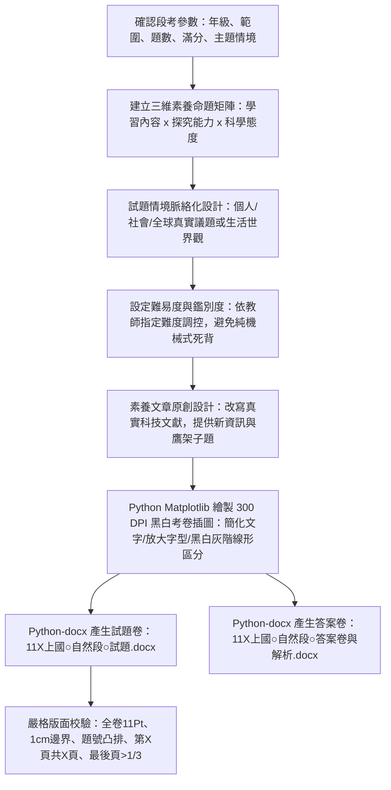

# 國高中自然科命題規範與自動化產卷技能 (jhsh-science-exam-generator)

本 Skill 專門用於指導 Antigravity 代理人自動化命題，生成完全符應「新北市立錦和高級中學」教務處/試務組規範，且深度結合教育部十二年國教自然科學領域核心素養、國教院素養導向評量要素與國際 PISA 2025 科學評量架構之正式試題卷與答案解析卷。

---

## 快速開始：使用者提詞標準模板 (User Prompt Template)

> [!TIP]
> **若使用者不知道如何下指令或初次使用本技能，請主動告知並引導使用者複製以下虛擬範例模板並依當次範圍修改：**

```text
請使用 /jhsh-science-exam-generator 技能為我生成一份自然科段考試卷，規格參數如下：
1、範圍：【請填寫章節，例如：第 4 章「光與透鏡成像」到 第 5 章「溫度與熱量傳播」】。
2、題型：【例如：單一選擇題，每題有四個選項 (A)(B)(C)(D)】。
3、題數：【例如：40 題（含單題與素養閱讀題組）】。
4、配分：總分 100 分【例如：第 1～20 題每題 3 分共 60 分；第 21～40 題每題 2 分共 40 分】。
5、難易程度：【例如：難易適中（預估平均通過率約 65%～70%）】。
6、其它：【選填，例如：以「火星生態基地探測任務」或「智慧綠建築日常節能」之虛擬情境串連試卷題組】。
```

當接收到上述模板需求時，代理人應立即自動化執行本技能所規範之一切標準（包括：全卷嚴格 11 點標楷體、1cm 邊界、題號凸排、題幹末尾章節標記【X-Y】、各選項配分極致均衡約 25%、Matplotlib 大字級向量插圖、產出雙份 Word 試題與解析卷，以及命題審題檢核表）。

---

## 核心工作流程 (Workflow)



---

## 一、 錦和高中試務組排版與格式標準規範

生成 Word (`.docx`) 檔案時，**必須嚴格遵循以下排版規則**：

1. **試題抬頭（粗體加底線）**：
   - 格式：<u>**新北市立錦和高級中學 11X學年度第X學期 [國中/高中]部○年級○○科第○次段考試題**</u>
   - 包含：﹝命題範圍：...﹞、右上角標註「班級：____ 座號：__ 姓名：________」。
2. **必放注意事項（警語）**：
   - 答案卡警語（紅色粗體）：「**答案卷(卡)未寫班級、姓名、座號，或畫卡錯誤致電腦無法判讀考生身份者，一律扣 5 分**」。
   - 非選題警語（若有非選）：「**非選擇題請用黑色墨水筆作答，違者扣非選擇題總分 5 分**」。
   - **作答與配分說明（整數計分規範）**：註明全卷題型（全選擇題 2B 劃記，或包含非選題）、題數與計分方式。**每一題皆必須給予「整數」分數，配分總分剛好 100 分，嚴禁出現小數點配分或折算分數**（例如 40 題配置：第 1～20 題每題 3 分計 60 分、第 21～40 題每題 2 分計 40 分，合計 100 分）。
3. **版面設定（Page Margins & Fonts）**：
   - **頁邊界**：上、下、左、右各 **1.0 cm**（0.3937 英吋）。
   - **字體**：中文一律使用 **標楷體**（或新細明體），英數字使用 **Times New Roman**。
   - **字體大小與層級（重要必備規範）**：
     - **試卷主標題**：13.5～14 Pt 粗體加底線（置中）。
     - **大題/任務章節標題**：11.5 Pt 粗體（如【第一部分：單一選擇題...】）。
     - **全卷正文一律維持 11 點字 (11 Pt)**：包含注意事項警語、素養題組引導短文、題目本文（含結尾章節出處標籤如【4-1】、【5-2】）、選項 (A)(B)(C)(D)、題組閱讀文章及詳細解析。嚴禁擅自縮小為 10 或 10.5 Pt，以確保快速影印機雙面油印至 B4 試卷時學生閱讀舒適清晰。
     - **圖片引言與說明（Caption）**：9.5 Pt 置中。
     - **頁尾動態頁碼**：10 Pt 置中。
   - **行距**：單行或 1.15 倍行距，段落後間距 1.5～2 Pt。
   - **題號格式**：題號必須**凸出（首行凸排 Hanging Indent）**，例如 `left_indent = 0.28 inch, first_line_indent = -0.28 inch`。
4. **頁面控制（省紙規範）**：
   - 試卷以 A4 格式排版，試務組會等比放大至 B4 雙面印出。
   - **最後一頁內容絕對不可少於整頁的 1/3**，必要時透過適當的圖片寬度、行距或選項並排微調。
5. **頁尾動態頁碼**：
   - 置中加入動態 Word 欄位：`〔第 X 頁，共 X 頁〕`（使用 `PAGE` 與 `NUMPAGES` 欄位代碼）。
6. **獨立檔案輸出與命名規則**：
   - 必須分別產生 **3 個獨立檔案**：試題卷、答案卷（含解析）、檢核表。
   - 檔名格式：`[學期][年級][科目]段[次]試題`，例如：`11X上國○自然段○試題.docx`、`11X上國○自然段○答案卷與解析.docx`。
7. **最節省空間之「文繞圖」試題插圖排版規範（重要核心規範）**：
   - **傳統獨立置中插圖之缺點**：若將每幅插圖獨立置於單獨段落置中，會佔用大量垂直高度（每題約需 3.5～4.5 英吋高度），造成試卷頁數快速膨脹、增加印製成本且版面鬆散。
   - **最佳空間節省實作標準（方案 B：Word 原生浮動「矩形文繞圖」）**：
     - **浮動錨定與對齊**：將試題插圖由行內物件（`wp:inline`）轉換為 Word 原生浮動錨點圖形（`wp:anchor`），設定為「**矩形文繞圖（wrapSquare，wrapText="bothSides"）**」。
     - **位置設定**：水平方向設定為相對於欄/邊界靠右對齊（`positionH relativeFrom="column" -> align="right"`），垂直方向錨定於題幹段落頂端（`positionV relativeFrom="paragraph" -> posOffset="0"`），間距設定為左側 144000 emus（約 11.3 Pt / 0.4 cm 邊距）、上下 36000 emus（約 2.8 Pt）。
     - **最佳圖片尺寸**：寬度設定為 **2.6～2.8 英吋**（約 6.6～7.1 cm），高度約 1.5～2.0 英吋。左側預留約 4.5 英吋之文字繞行寬度，恰好容納題幹與四個選項在圖片左側整齊流暢繞行，使題目總高度與圖片高度完美契合，**垂直版面直接節省 40%～50%**！
     - **題組防重複碰撞原則**：當題組連續小題共用同幅插圖時，**僅在第一小題（初次提及題）嵌入浮動文繞圖**；後續題號（如「承上題」）僅以文字參照，嚴禁連續題號重複插入相同浮動圖形，以避免 Word 浮動錨點碰撞重疊。
     - **選項相應排列規則**：當題目含有右側浮動圖形時，左側文字區寬度約 4.5 英吋，四個選項一律採單列排列（`1 option per line`），避免雙欄選項擠在左側發生混亂折行；未附圖之題目則維持「長度 $\le 14$ 字一列四選項、長度 $\le 24$ 字兩列兩選項、其餘單列」之極致緊湊配置。

---

## 二、 國家教育研究院與臺師大心測中心「科學素養命題核心準則」

依據國教院《素養導向「紙筆測驗」要素》與臺師大心測中心《國中階段自然科學領域素養導向評量試題研發》規範，命題必須具備以下核心維度：

### 1. 三維素養命題參考架構（3D Assessment Matrix）
每一道試題需同時檢核三個向度：
- **向度一：核心概念 (Knowledge/Content)**：
  - K1 知曉（Remember）：科學名詞、符號、單位、安全規則。
  - K2 理解（Understand）：概念分類、現象關聯、原理解釋。
  - K3 應用（Apply）：數值計算、圖表轉換、情境實踐。
- **向度二：探究能力（Inquiry & Problem Solving - I1~I6）**：
  - **I1 審視資訊並界定問題**：從觀察中發現矛盾、提出探究問題或假說。
  - **I2 規劃實驗／探究計畫**：辨別操縱變因、控制變因與應變變因，設計實驗步驟。
  - **I3 執行實驗／探究計畫**：正確操作儀器、客觀記錄數據、指出實驗操作漏洞與修正方法。
  - **I4 分析與陳述數據**：讀取多重圖表、辨識數據趨勢、表格與圖形轉換。
  - **I5 解釋數據並說明推理過程**：連結實驗數據與科學原理，推論因果關係或建立預測模型。
  - **I6 分享與評鑑實驗／探究結論**：評估實驗推論是否充分且可信賴，提出改善方案。
- **向度三：科學的態度與本質（Nature of Science - NA1~NA5）**：
  - **NA1 覺察**：體察科學知識的發展性、不確定性與時空演變。
  - **NA2 動機與興趣**：透過生活或探究情境激發解決問題意願。
  - **NA3 審視與評價**：對媒體報導、權威說法或網路資訊抱持合理懷疑態度。
  - **NA4 參與科學議題**：運用科學證據做出理性決策（如環保、食安、資源永續）。
  - **NA5 建立科學自我效能感**：藉由科學推理建立探究信心。

### 2. 閱讀素養文章與題組之「高鑑別度命題準則」
- **杜絕常識作答**：學生**無法僅憑日常常識或語文猜測作答**，作答必須同時融合「文章提供之新資訊」與「課堂所學之核心科學知識」。
- **選文原創性與差異性**：
  - 閱讀素養文章嚴禁直接搬用課本或習題原篇。應從真實科學事件（如深海熱泉生態系、太陽能光電材料、極地冰芯古氣候紀錄、酵素工業催化等）改寫。
  - 文章內容提供學生未學過的「新變數」或「新情境資訊」，但子題所評量的核心原理**嚴格不超出課綱範圍**。
- **子題設計採用「鷹架式漸進提問」（Scaffolding）**：
  - 子題 1：新資訊與圖表擷取／概念轉譯。
  - 子題 2：結合學科知識之因果推理／變因連結。
  - 子題 3：高層次反思、科學論證評鑑（正反證據評析）或實驗修正方案。

### 3. 試題難易度與鑑別度調控
- **目標難度**：依教師指定之難易度（如難易適中或中等偏難）精準調控全卷預估平均通過率。
- **高鑑別度關鍵（點二系列相關 $r_{pb} \ge 0.35$）**：
  - **少出純機械式死記題**（如純粹背誦定義）。
  - **多出跨概念推理題**（如結合實驗表格數據趨勢與光路/電路/力學圖形進行二階段推論）。
  - **設計具診斷價值之誘答選項**：選項針對學生常見的直覺迷思（如：以為凸透鏡遮住一半則成像缺一半、以為作用力與反作用力可互相抵銷、以為植物在白天只行光合作用不行呼吸作用等）。
  - **問題解決模式**：題幹常採用真實實驗情境（例如：若實驗出現某異常狀況，如何調整控制變因以達到目標？）。

### 4. 國際 PISA 2025 評量指標融入
- **情境脈絡**：涵蓋個人（健康/生活用品）、社會（再生能源/水資源淨化/環境生態）、全球（氣候變遷/太空探索/生物多樣性）。
- **科學認識論知識 (Epistemic Knowledge)**：考查學生能否理解「科學模型具有其適用邊界與限制」、「實驗測量必然存在不確定性與誤差」、「科學結論需由重複實驗之數據所支持」。

---

## 三、 Python 考卷插圖與圖例繪製嚴格標準 (Matplotlib)

若試題需要關係圖或實驗器材圖，**一律使用 Python 在後台動態生成 300 DPI 白底圖片**，存入工作目錄後再嵌入 docx。

### 1. 圖片與圖例文字精簡原則（重要新規範）
- **圖片內文字精簡化**：**圖片內部或圖例說明中，切忌放入長篇敘述文字**！所有實驗情境、操作背景、限制條件與詳細文字說明，**一律移至考卷題幹或題目本文中詳細描述**。
- **圖內僅保留核心要素標籤**：例如代號（甲、乙、丙、丁）、軸名稱與物理量符號單位（如 $T\ (^\circ\text{C})$、$F\ (\text{gw})$、$t\ (\text{min})$）、刻度數值、點座標標記與簡潔名詞（如「焦點 $F$」、「光源」）。

### 2. 圖片文字可讀性（特大字級標準 +8 Pt 與零碰撞遮擋規範）
- **插圖字級特大化標準（重要必備規範，基準 +8 Pt）**：中學試卷通常經由印刷機縮放或投影機展示，原版 9～12 pt 在高速油印或雙面縮小印至 B4 時易發生字跡模糊或辨識困難。經實務印刷與試場檢驗，**所有考卷插圖文字字級全面調高 8 Pt（即基準 +8 Pt 特大清晰標準，達到 16.5～21 Pt）**，以達成極致清晰與高辨識度：
  - **圖表總標題／附圖說明（Title / Caption）**：`fontsize=19.5 ~ 21` 粗體置中（例如「圖(一) 凸透鏡成像實驗裝置圖」、「圖(三) 酵素活性與溫度關係圖」）。
  - **關鍵物件／線條代號／器材標籤（甲、乙、丙、丁、器材名稱）**：`fontsize=18 ~ 19.5` 粗體（直接標於線端、上方或引線末端）。
  - **引線與觀察標註（Annotations）**：`fontsize=18 ~ 19` 粗體。
  - **座標軸物理量與單位（xlabel / ylabel）**：`fontsize=18 ~ 19` 粗體。
  - **座標刻度數值（xticks / yticks）**：`fontsize=16.5 ~ 17.5`（刻度數字特大清晰，高速印刷或縮小不模糊）。
  - **尺寸長度／點座標標註（Dimensions / Coordinates）**：`fontsize=17 ~ 18.5` 粗體。
  - **圖例說明區塊／次要標註（Legend / Sub-annotations）**：`fontsize=15.5 ~ 16.5`。
- **畫布、視角邊界與排版防碰撞防遮擋規範**：
  - **寬幅外擴與視角延伸（xlim / ylim）**：因字級大幅放大（16.5～21 Pt），傳統緊湊坐標範圍會導致邊界文字溢出或引線碰撞。必須主動拉大坐標範圍，預留充足邊距。
  - **複雜分區與密集標籤之防重疊錯位錨定**：在多曲線或多區域關係圖中，區域代號與局部標記點須採取上下/左右錯位錨定，嚴禁標籤重疊。
  - **圖名完整性與對稱標籤規範**：儀器結構圖正下方務必加註完整圖名說明，關鍵零件採對稱清晰標註，呼應試題選項。
  - 文字標籤與線條、數據點之間需保留足夠 offset 邊距（例如 `xytext` 搭配適當坐標平移或白色底框 `bbox=dict(boxstyle='square,pad=0.2', fc='white', ec='none')`）。
  - **圖例說明區塊（Legend）一律放置於圖形外側旁邊**（例如右側 `bbox_to_anchor=(1.02, 1), loc='upper left'`），或採用直接標註於線段末端方式，**絕不可覆蓋住任何曲線、折線、網格交點或數據點**。

### 3. 黑、白、灰階印刷之視覺區分規範
試卷經試務組高速油印機印刷後皆為黑白灰階，為確保學生在黑白紙本上清晰判讀，**嚴禁依賴彩色來區分不同線段或物件**，必須採取多元幾何特徵區分：
- **線條型態（Line Styles）**：
  - 實線（Solid `'-'`，線寬 `lw=2.2`）：實驗組甲或基準曲線。
  - 虛線（Dashed `'--'`，線寬 `lw=2.0`）：實驗組乙或對照曲線。
  - 點線（Dotted `':'`，線寬 `lw=1.8`）：輔助線、法線或主軸。
  - 雙點虛線（Dash-dot `'-.'`，線寬 `lw=2.0`）：實驗組丙或理論趨勢線。
- **數據點標記（Markers）**：
  - 實心圓點 (`marker='o'`）、空心圓點（`marker='o', markerfacecolor='white'`）。
  - 實心正方形 (`marker='s'`）、正三角形 (`marker='^'`）、菱形 (`marker='D'`)。
- **填充分區（Hatching & Grayscale Fill）**：
  - 封閉區塊（如柱狀圖、地層剖面、力學木塊）：採用不同灰階（如 `#FFFFFF` 白色、`#E0E0E0` 淺灰、`#808080` 深灰、`#000000` 純黑）。
  - 斜線網格填充（Hatch Pattern）：如 `'///'` 斜線、`'\\\\'` 反斜線、`'xxx'` 交叉網格，確保即使複印對比度下降也能一目了然。

### 4. 常見科學圖表類型與命題不超綱原則：
- **物理與力學/光學/電學關係圖**：如加熱時間與溫度變化折線圖、彈簧受力與伸長量關係圖、透鏡光路成像圖、歐姆定律電壓電流關係圖。
- **化學實驗與反應趨勢圖**：如反應速率曲線圖、酸鹼滴定 pH 變化曲線、實驗室標準儀器裝置示意圖。
- **生物與地球科學構造圖**：如顯微鏡構造與視野移動圖、酵素活性曲線、地質剖面與岩層先後順序圖、天氣系統等壓線圖。
- **嚴格遵守課綱邊界**：命題前務必檢視工作區內之課本電子書 PDF，嚴禁使用高年級尚未教授之超綱術語或公式。

---

## 四、 試卷與解析卷 Word 生成輔助程式庫架構

在撰寫產生腳本時，應封裝下列關鍵函式（可複用至任何段考）：

```python
import os
import docx
from docx import Document
from docx.shared import Inches, Pt, RGBColor
from docx.enum.text import WD_ALIGN_PARAGRAPH
from docx.oxml import OxmlElement, parse_xml
from docx.oxml.ns import nsdecls, qn

# 1. 設定邊界 1cm 與全卷 11 點標楷體
def set_base_style(doc):
    for s in doc.sections:
        s.top_margin = Inches(0.3937)    # 1 cm
        s.bottom_margin = Inches(0.3937) # 1 cm
        s.left_margin = Inches(0.3937)   # 1 cm
        s.right_margin = Inches(0.3937)  # 1 cm
    style = doc.styles['Normal']
    style.font.name = '標楷體'
    style.font.size = Pt(11) # 嚴格保持全卷 11 點字
    style._element.rPr.rFonts.set(qn('w:eastAsia'), '標楷體')

# 2. 插入題號凸排段落（保持 11 Pt）
def add_question(doc, num, text, options=None, img_path=None, img_width=Inches(2.7), bloom_tag=None):
    p = doc.add_paragraph()
    p.paragraph_format.left_indent = Inches(0.28)
    p.paragraph_format.first_line_indent = Inches(-0.28) # 凸排
    p.paragraph_format.line_spacing = 1.15
    run_num = p.add_run(f"({num:>2}) ")
    run_num.bold = True
    p.add_run(text)
    
    # 若附圖，採用最節省空間之浮動「文繞圖」（靠右對齊 wrapSquare）
    if img_path and os.path.exists(img_path):
        make_floating_image(p.add_run(), img_path, width=img_width, align="right", wrap="bothSides")

# 3. 最節省空間之 Word 原生浮動「矩形文繞圖」函式 (方案 B)
def make_floating_image(run, img_path, width=Inches(2.7), align="right", wrap="bothSides"):
    """
    將插入圖片轉換為 Word 原生浮動 wrapSquare 錨點，使題幹與選項在左側流暢繞行，大幅節省 40%~50% 垂直版面
    """
    inline_shape = run.add_picture(img_path, width=width)
    inline = inline_shape._inline
    
    extent = inline.find(qn('wp:extent'))
    docPr = inline.find(qn('wp:docPr'))
    cNvGraphicFramePr = inline.find(qn('wp:cNvGraphicFramePr'))
    graphic = inline.find(qn('a:graphic'))
    
    cx = extent.get('cx')
    cy = extent.get('cy')
    docPr_id = docPr.get('id')
    docPr_name = docPr.get('name')
    
    anchor_xml = f'''
    <wp:anchor {nsdecls("wp", "a")} distT="36000" distB="36000" distL="144000" distR="0" simplePos="0" relativeHeight="251658240" behindDoc="0" locked="0" layoutInCell="1" allowOverlap="0">
        <wp:simplePos x="0" y="0"/>
        <wp:positionH relativeFrom="column">
            <wp:align>{align}</wp:align>
        </wp:positionH>
        <wp:positionV relativeFrom="paragraph">
            <wp:posOffset>0</wp:posOffset>
        </wp:positionV>
        <wp:extent cx="{cx}" cy="{cy}"/>
        <wp:effectExtent l="0" t="0" r="0" b="0"/>
        <wp:wrapSquare wrapText="{wrap}"/>
        <wp:docPr id="{docPr_id}" name="{docPr_name}"/>
    </wp:anchor>
    '''
    anchor = parse_xml(anchor_xml)
    if cNvGraphicFramePr is not None:
        anchor.append(cNvGraphicFramePr)
    if graphic is not None:
        anchor.append(graphic)
        
    parent = inline.getparent()
    parent.replace(inline, anchor)
    return anchor
```

---

## 五、 產卷前檢核清單 (Checklist)

每次完成試題產出後，必須根據**錦和高中命題及審題檢核表**與**指引包核心規範**自檢：
- [ ] 試卷標題是否含校名、學年度、學期、部別、領域、命題範圍、班級座號姓名欄？
- [ ] 是否包含答案卡未寫姓名座號扣 5 分警語？
- [ ] 全卷總分是否剛好 100 分？各大題配分是否皆為整數且清晰無誤？
- [ ] 題號是否連續無跳號？是否全數為四選一且選項無重複？
- [ ] 題目概念是否無重複出題？是否符合課綱進度且無超綱？
- [ ] 難易度是否符合教師指定目標？誘答選項是否具有診斷迷思之鑑別力？
- [ ] 閱讀素養文章是否具原創性（與現成習題完全不同）？是否無法單憑常識作答？
- [ ] 圖片圖例文字是否精簡（詳細敘述放題幹）、採用特大字級標準（基準 +8 Pt：標題 19.5~21pt、物件代號與器材標籤 18~19.5pt、刻度 16.5~17.5pt、尺寸標註 17~18.5pt）且零碰撞零遮擋？
- [ ] 圖片是否以黑、白、灰階印刷標準設計（實線/虛線/點線/灰階/網格填充多元區分）？
- [ ] 附圖試題是否採用最節省空間之「文繞圖」排版（靠右浮動 wrapSquare、寬度 2.6~2.8 英吋、題組共用圖不重複插入造成碰撞）？
- [ ] 全卷試題本文、選項、題組文本與解析是否一律嚴格維持 11 點字 (11 Pt)？題幹末尾是否標註章節編號【X-Y】？
- [ ] 試卷最後一頁是否超過 1/3 版面？
- [ ] 答案卷是否包含「快速核對卡號表格」與「Bloom/探究能力雙向度詳細題解」？
